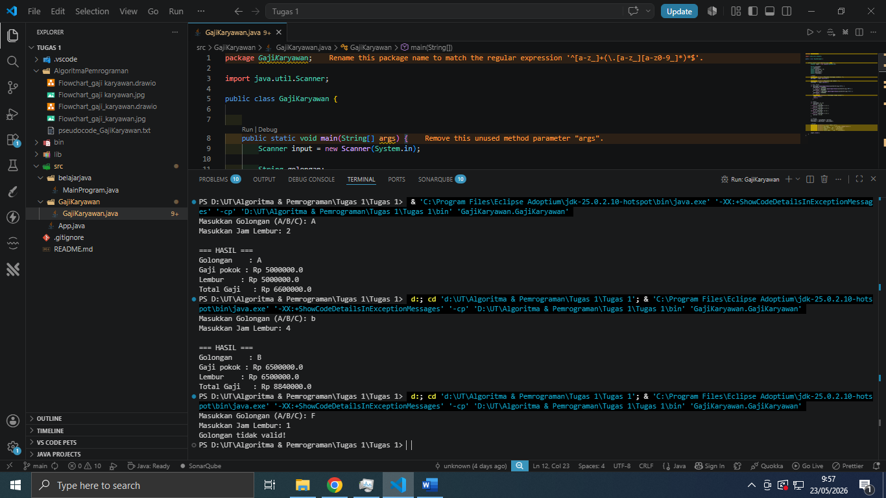
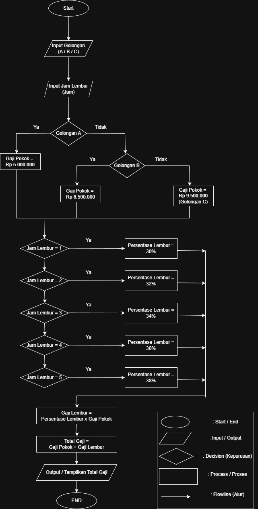

# Tugas-1 Java

This project is a simple Java program for employee salary classification and overtime salary calculation based on employee groups.

## Program Features

- Employee group input
- Salary classification based on employee group
- Overtime hours calculation
- Total salary calculation
- Displaying salary calculation results

## Concepts Used

This program uses several basic Java programming concepts, such as:

- Variables
- User input with Scanner
- Conditional statements (`if`, `switch`)
- Arithmetic operations
- Console output

## Folder Structure

```text
src/        -> Java source code
README.md   -> Project documentation
```

## How to Run the Program

### Using Visual Studio Code

1. Open the project in Visual Studio Code
2. Make sure Java is installed
3. Run the Java file inside the `src` folder

### Using Terminal

```bash
javac FileName.java
java FileName
```

## Example Input

```text
Enter employee group : A
Enter overtime hours : 5
```

## Example Output

```text
Base Salary : 5000000
Overtime Salary : 250000
Total Salary : 5250000
```

## Technologies Used

- Java
- Visual Studio Code
- Git & GitHub

## Program Screenshot



## Program Flowchart



## Author

Smard-I
